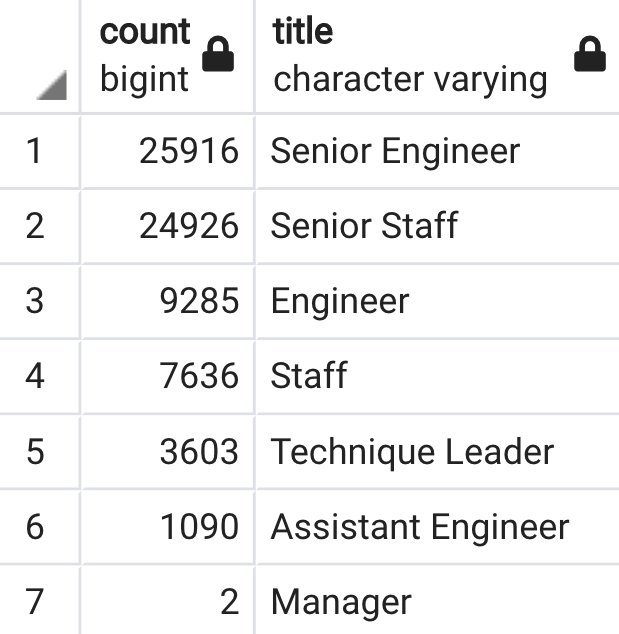
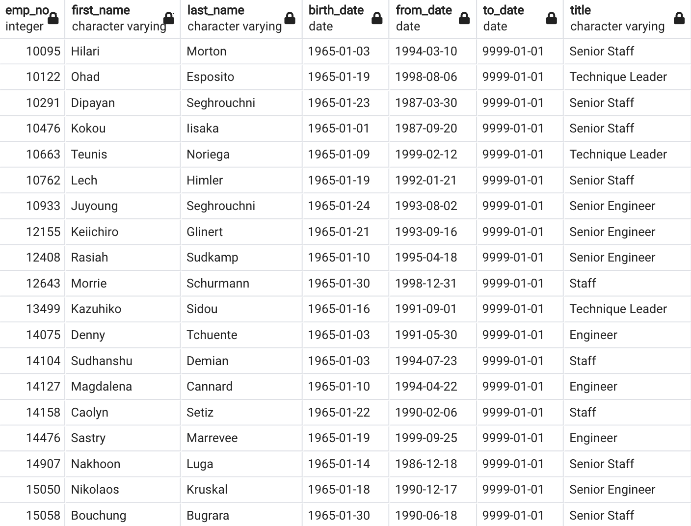

# Pewlett-Hackard-Analysis

## Overview of the analysis:

Perform an analysis of a database, data modeling and engineering to determine the number of retiring employees and identify those who are eligible to participate in a mentorship program for a company called Pewlett Hackard.
Using techniques as : 

*  ERDs
* Importing data
* Query dates 
* Joinning, counting  & grouping 
* Additional & tailored lists

## Results: 

In the following image you will see that:

* Most of the retirements employees are Senior Engineer and Senior Staff representing the 60% of all the retirements.
* There are 2 managers who will retire soon as well.

* According to the next table the mentorship elegibility there are 1549 employees that could be candidates from this program.

